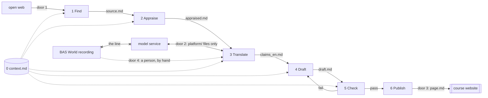

# Technical Blueprint — the BAS World handbook platform

Bos · Godlieb · Van Vreeswijk · Yapici · document 2 of 6, implements PRD v2.1 · v1.0 · 17 September 2026 · pen: developer

**What the platform is for.** Four students produce one English handbook page per week for the owner of a Dutch used-vehicle trader (10–50 staff, no IT function), with BAS World as case, where every statement traces to a saved source and a quoted sentence. The platform makes that page producible in one week without four people doing all of it by hand.

**Altitude.** The drawing is the production line: what happens before what, and which file is handed over. The company view is one line: the product manager is the boss, the developer owns find/translate/draft, the tester owns appraise/check, the deployer owns publish, and a rotating second reader (never the author) checks what a tool cannot.

## 1. The parts

A part is a stage on the path from a source to a published page. Each takes a file and produces a file, so any stage can be done by a person instead.

| # | Part | One sentence |
|---|------|--------------|
| 0 | **Context** `context.md` | Holds the target SME, the six quality criteria, what is out of scope and the house style; every part reads it first. |
| 1 | **Find sources** | Takes the research question and returns Dutch and English sources, each saved with URL, date and language. |
| 2 | **Appraise** | Rates each source on credibility, relevance and recency, writes the reason, and records any human override. |
| 3 | **Translate** | Turns each Dutch sentence we use into an English claim with the original sentence and attribution intact. |
| 4 | **Draft** | Writes the page from appraised claims only; a statement without a source and a quoted sentence does not enter. |
| 5 | **Check** | Holds the draft against the tool-checkable criteria and traceability, and returns pass/fail per statement. |
| 6 | **Publish** | Places an approved page on the course site with a version and a checking note. |

*Not a part:* the BAS World interview. A person transcribes, anonymises and writes the claims into `claims_en.md` by hand (see §4). This departs from PRD v1.2 step 3; PRD v2.1 records it.



**Control.** One boss. In weeks 2–3 the boss is a person: the product manager runs the stages in order from the command line and reads `check.md` before anything moves on. From week 4 an orchestrator part takes over one stage at a time as each passes its build-plan test; publish stays behind a human for the whole run.

## 2. What passes between the parts

Every handover is a Markdown file with a fixed, named shape, inside one `platform/` folder.

| Seam | File | Fixed fields |
|------|------|--------------|
| Find → Appraise | `source.md` | id, url, retrieved, language, publisher, type, excerpt |
| Appraise → Translate | `appraised.md` | source id; credibility, relevance, recency (1–3); reason; human_override (who, why); decision use/discard |
| **Translate → Draft** | **`claims_en.md`** | **below** |
| Draft → Check | `draft.md` | page sections per chapter template; every statement carries `[claim-id]` |
| Check → Publish or Draft | `check.md` | per statement: claim exists, quote matches, number matches, duty named (crit. 3), labels present (crit. 4) → pass/fail + one line; second-reader verdicts on crit. 1, 2, 5, 6; final: publish / return |

**The named seam: original_nl → translation_en.** Our best sources are Dutch, the handbook is English; somewhere a Dutch sentence becomes an English claim with its meaning and attribution intact. Translate produces `claims_en.md`; Draft may use nothing that is not in it. One block per claim:

```yaml
- claim_id: W2-014        # source_id must exist in appraised.md, decision: use
  source_id: S-007
  location: "p. 3, table 2"
  original_nl: "<verbatim, never edited>"
  translation_en: "<English claim>"
  kind: number | quote | statement
  evidence: company-reported | independently-verifiable
  scope: case | sector
  translated_by: tool | person
  verified_by: "<name>"   # required for number and quote; empty fails at Check
```

English sources use the same block with the English sentence in `original_nl`, so traceability is one rule. Because the contract is a file, two of us build either side at once, and when Translate is wrong a person rewrites the block and Draft never notices.

## 3. The shared desk

One file, `context.md`, read by every part before it acts; owned by the product manager; versioned at the top. Contents: the target reader; BAS World as frontier (not representative) case; the six criteria verbatim from PRD v2.1 §3; the out-of-scope list (CLI only, English only, no training on BAS material, nothing published unchecked); the house style (labels, "names a step, never a tool", one next step). Delivered with this blueprint.

## 4. The doors and the line

| Door | Passes | Rule |
|------|--------|------|
| 1 open web | queries out, sources in | Saved as `source.md` with URL and date, or it does not exist. |
| 2 model service | `platform/` files out, output in | Only files inside `platform/`. Never a free-tier tool. Vendor and hosting: open (§6). |
| 3 course site | `page.md` | Only after `check.md` says publish and a person approves. |
| 4 partner firm | interview material | A person only; consent signed off before the visit. |

**The line: the interview recording, its transcript and the anonymised transcript never reach a model service.** What keeps it there: they live outside `platform/` on one laptop, and door 2 accepts only files inside `platform/`; a person writes what we use into `claims_en.md`, labelled company-reported / case / translated_by: person; deleted after the module. Checked in one place, the folder boundary. Cost: PRD v1.2's automatic transcription is dropped, because its processing environment was an open question and a line resting on an open question is not a line.

## 5. Being wrong

**Check** reads every draft first: claim-id present, source exists, quote appears in the saved source, every number and date matches (no sampling), duty named, labels present. Any fail returns `check.md` to Draft with one line each; nothing passes silently. **The second reader**, rotating weekly and never the author, judges criteria 1, 2, 5 and 6 and opens the source for five statements of their choice. On any fail the page is not published; the author repairs; the product manager arbitrates. Ratings carry a reason and an override field because they can be wrong too. Five of roughly forty statements will not catch everything; each page says how much was checked.

## 6. Trace to the PRD, and what is open

| PRD v2.1 promise | Lands in |
|------------------|----------|
| §2 steps 1, 2, 4, 5, 6 | Parts 1, 2, 4, 5, 6 and their files |
| §2 interview handling | Not a part: door 4, a person — dropped from v1.2, reason above |
| §2 step 3 translation; §5 numbers and quotes match | Part 3, `claims_en.md` — added to PRD v2.1 |
| §4 manual back-up per step; no code; runnable by a non-programmer | Files as contracts; person-as-boss (§1) |
| §6 three weekly measures | Time log by hand outside the platform; counts from `check.md` |
| §6 four safeguards | Draft rule, Check, second reader, override field |
| §7 constraints and the line | `context.md`, doors 3 and 4, §4 |
| §8 where to process the recording | Closed by the line; reopened only with a DPA |
| Proposal §5 scan of 20–30 traders | Source type in Find — added to PRD v2.1 |

Every promise lands in a part or is named as dropped, with a version, date and reason in PRD v2.1.

**Open, with owners.** (1) The vendor behind door 2: owner, hosting, plan — developer, week 3; this week's handbook theme applied to ourselves. (2) How many ratings a person reads — tester, after the week-2 manual baseline. (3) Whether the anonymised transcript may ever pass door 2: only with a DPA, EU hosting and consent — product manager, week 3. (4) Which stage the orchestrator part takes first in week 4 — developer, build plan.
