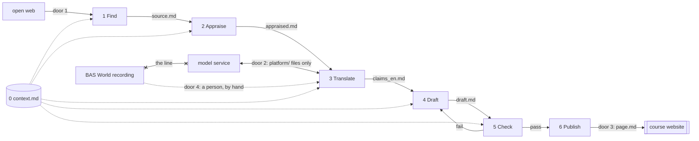

# Technical Blueprint — the BAS World handbook platform

Bos · Godlieb · Van Vreeswijk · Yapici · document 2 of 6, implements PRD v2.1 · v1.1 · 21 September 2026 · pen: developer

**What the platform is for.** Four students produce one English handbook page per week for the owner of a Dutch used-vehicle trader (10–50 staff, no IT function), with BAS World as case, where every statement traces to a saved source and a quoted sentence. The platform makes that page producible in one week without four people doing all of it by hand.

**Altitude.** The drawing is the production line: what happens before what, and which file is handed over. The company view is one line: the product manager is the boss, the developer owns find/translate/draft, the tester owns appraise/check, the deployer owns publish, and a rotating second reader (never the author) checks what a tool cannot.

## 1. The parts

A part is a stage on the path from a source to a published page. Each takes a file and produces a file, so any stage can be done by a person instead.

| # | Part | One sentence |
|---|------|--------------|
| 0 | **Context** `context.md` | Holds the target SME, the four baseline requirements and six quality criteria, what is out of scope and the house style; every part reads it first. |
| 1 | **Find sources** | Takes the research question and returns Dutch and English sources, each saved with URL, date and language. |
| 2 | **Appraise** | Rates each source on credibility, relevance and recency, writes the reason, and records any human override. |
| 3 | **Translate** | Turns each Dutch sentence we use into an English claim with the original sentence and attribution intact. |
| 4 | **Draft** | Writes the page from appraised claims only; a statement without a source and a quoted sentence does not enter. |
| 5 | **Check** | Holds the draft against the tool-checkable criteria and traceability, and returns pass/fail per statement. |
| 6 | **Publish** | Places an approved page on the course site with a version and a checking note. |

*Not a part:* the BAS World interview. A person transcribes, anonymises and writes the claims into `claims_en.md` by hand (§4) — dropped from PRD v1.2, recorded in PRD v2.1's version history.



**Control.** One boss. In weeks 2–3 the boss is a person: the product manager runs the stages in order from the command line and reads `check.md` before anything moves on. From week 4 an orchestrator part takes over one stage at a time as each passes its build-plan test; publish stays behind a human for the whole run.

### 1a. Who executes each part, weeks 2–3

"Code" is never the answer here — we write no software (PRD §4).

| Part | Executor, weeks 2–3 |
|---|---|
| 0 Context | Person (PM) |
| 1 Find | Model; person checks URL/date |
| 2 Appraise | Model rates; person reads all, can override |
| 3 Translate | Model; person verifies every number/quote |
| 4 Draft | Model; person picks the angle, edits |
| 5 Check | Model (tool columns); person, 2nd reader (crit. 1/2/5/6) |
| 6 Publish | Person (deployer) only |

PRD §4's manual back-up is simply "do it by hand" for parts 1–4 and 6. Two gaps: **Check has no back-up named at all**, and the original list named the interview as one — which cannot be right, since the interview was never a tool step (§2) to begin with.

## 2. What passes between the parts

Every handover is a Markdown file with a fixed, named shape, inside one `platform/` folder.

| Seam | File | Fixed fields |
|------|------|--------------|
| Find → Appraise | `source.md` | id, url, retrieved, language, publisher, type, excerpt |
| Appraise → Translate | `appraised.md` | source id; credibility, relevance, recency (1–3); reason; human_override (who, why); decision use/discard |
| **Translate → Draft** | **`claims_en.md`** | **below** |
| Draft → Check | `draft.md` | page sections per chapter template; every statement carries `[claim-id]` |
| Check → Publish or Draft | `check.md` | claim exists, quote/number match, duty (crit. 3), labels (crit. 4), source `decision: use` (appraised.md) → pass/fail; second reader on crit. 1, 2, 5, 6, with the five opened claim-ids on record; final: publish / return |

**The named seam: original_nl → translation_en.** Our best sources are Dutch, the handbook is English; somewhere a Dutch sentence becomes an English claim with its meaning and attribution intact. Translate produces `claims_en.md`; Draft may use nothing that is not in it. One block per claim:

```yaml
- claim_id: W2-014        # source_id must exist in appraised.md, decision: use
  source_id: S-007
  location: "p. 3, table 2"
  original_nl: "<verbatim, never edited>"
  translation_en: "<English claim>"
  kind: number | quote | statement
  evidence: company-reported | independently-verifiable
  scope: case | sector
  translated_by: tool | person
  verified_by: "<name>"   # required for number and quote; empty fails at Check
```

English sources use the same block with the English sentence in `original_nl`, so traceability is one rule. Because the contract is a file, two of us build either side at once, and when Translate is wrong a person rewrites the block and Draft never notices.

## 3. The shared desk

One file, `context.md`, read by every part before it acts; owned by the product manager; versioned at the top. Contents: the target reader; BAS World as frontier (not representative) case; the four baseline requirements and six criteria (PRD v2.1 §3), each naming tool or second reader as its checker; the out-of-scope list (CLI only, English only, no training on BAS material, nothing published unchecked); the house style. Delivered with this blueprint.

## 4. The doors and the line

| Door | Passes | Rule |
|------|--------|------|
| 1 open web | queries out, sources in | Saved as `source.md` with URL and date, or it does not exist. |
| 2 model service | `platform/` files out, output in | Only files inside `platform/`. Never a free-tier tool. Vendor and hosting: open (§7). |
| 3 course site | `page.md` | Only after `check.md` says publish and a person approves. |
| 4 partner firm | interview material | A person only; consent signed off before the visit. |

**The line: the interview recording, its transcript and the anonymised transcript never reach a model service.** They live outside `platform/` on one laptop; door 2 accepts only files inside `platform/`; a person writes what we use into `claims_en.md`, labelled company-reported / case / translated_by: person; deleted after the module. Cost: PRD v1.2's automatic transcription is dropped, since a line resting on an unresolved processing environment isn't a line.

## 5. Being wrong

**Check** reads every draft first: claim-id present, source exists, quote appears in the saved source, numbers/dates match (no sampling), duty named, labels present, source still `decision: use`. Any fail returns `check.md` to Draft with one line each. **The second reader**, rotating and never the author, judges criteria 1, 2, 5, 6 and opens five statements of their choice against source, ids recorded in `check.md`. Any fail: not published; author repairs; PM arbitrates. Ratings carry a reason and an override field, since they can be wrong too. Five of roughly forty statements won't catch everything; each page says how much was checked.

## 6. Trace to the PRD, and what is open

| PRD v2.1 promise | Lands in |
|---|---|
| §2 steps 1–6; §5 tests (ten sources; twenty numbers, three quotes) | Parts 1–6; rest of build-phase testing in the build plan, if separate |
| §2 interview, step 3 translation; proposal v2 §5 trader scan | Version history: interview → door 4/person; translation → Part 3; scan → Find |
| §4 back-up per step (Check's missing, §1a); no code; non-programmer runs it | Files as contracts; person-as-boss (§1) |
| §6 measures and safeguards | Time log outside the platform, counted from `check.md`; Draft rule, Check, 2nd reader, override |
| §7 constraints/line; §8 recording location | `context.md`, doors 3–4, §4; closed by the line, reopened only with a DPA |

Every promise lands in a part or is named as dropped, reason in PRD v2.1's version history.

## 7. Back to the open questions from week 1

Startpoint: PRD §8, which now points here — one tracker, not two.

| Open question | Status |
|---|---|
| Recording location | Closed: stays outside `platform/`, person transcribes (§4); reopen only with a DPA |
| Trust an automatic rating? | Partly open: reason + override field exists; how many ratings the tester reads is undecided |
| Work not fit in one week? | Open until the week-2 measurement (`timelog.csv`) |
| Page not traceable to source? | Answered: claim-id, quote, `verified_by` per claim |
| Marketing pages as primary (S-012, S-014)? | Partly open: proposal §5 wants contract docs, not marketing; tester wrote a per-row override instead of the blanket PM one (`appraised.md`); reopen if a better source turns up |
| One failed search = "nothing found"? | Answered: a second search line found S-017 (own G1/G5 caveats); rule is now two lines before reporting absence |
| One source per region enough? | Answered for China: rule tightened to two per perspective, one at credibility 3; S-018 (State Council) added alongside S-009. US/Europe not yet re-checked |
| Which five statements did the 2nd reader open? | Open: column exists in `check.md`; Floyd still has to name them |
| Filled-in assignment 1/2 text? | Open: put it in the repo, or fill the remaining placeholders |

**Build-scope, with owners:** vendor behind door 2 — developer, week 3. Ratings-read count — tester, post-baseline. Transcript past door 2 (DPA, EU hosting) — PM, week 3. Orchestrator's first stage — developer, build plan. Check's missing back-up — tester, before week 4.
