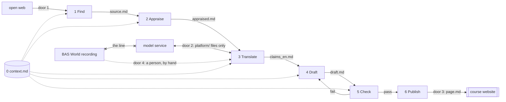

# Technical Blueprint — the BAS World handbook platform

Bos · Godlieb · van Vreeswijk · Yapici · document 01, implements PRD v2.1 (document 02) · v1.1 · 21 September 2026 · pen: developer

**What the platform is for.** Four students produce one English handbook page per week for the owner of a Dutch used-vehicle trader (10–50 staff, no IT function), with BAS World as case; every statement traces to a saved source and a quoted sentence. The platform makes that producible in one week without four people doing all of it by hand. The drawing is the production line: what happens before what, and which file is handed over.

## 1. The parts

A part is a stage from source to published page. Each takes a file and produces a file, so a person can do any stage instead. Roles as in PRD §5, plus a rotating second reader (never the author) for what a tool cannot check.

| # | Part | One sentence | Executor, weeks 2–3 |
|--|-------|------------------------------|------------------|
| 0 | **Context** `context.md` | Target SME, requirements, criteria, out-of-scope list, house style; read first by every part. | Person (PM) |
| 1 | **Find sources** | Returns Dutch and English sources saved with URL, date and language. | Model; person checks URL and date |
| 2 | **Appraise** | Rates each source on credibility, relevance and recency, with a reason and any human override. | Model rates; tester reads all rows, can override |
| 3 | **Translate** | Turns each Dutch sentence we use into an English claim, original and attribution intact. | Model; person verifies every number and quote |
| 4 | **Draft** | Writes the page from appraised claims only; no source and quoted sentence, no statement. | Model; person picks the angle, edits |
| 5 | **Check** | Tests the draft on tool-checkable criteria and traceability; pass/fail per statement. | Model (tool columns); second reader (crit. 1, 2, 3 correctness, 5, 6) |
| 6 | **Publish** | Puts an approved page on the course site with version and checking note. | Person (deployer) only |

**Back-up (PRD §4).** For every part, a person does the same by hand. For Check, the tester fills the same `check.md` columns from `sources/`, `claims_en.md` and `appraised.md`, so nothing downstream changes.



**Control.** One boss. In weeks 2–3 the product manager runs the stages in order and reads `check.md` before anything moves on. From week 4 an orchestrator takes over one stage at a time as each passes its build-plan test; publish stays behind a human throughout.

## 2. What passes between the parts

Every handover is a Markdown file with a fixed, named shape, inside one `platform/` folder.

| Seam | File | Fixed fields |
|--------------|----------|------------------------------------|
| Find → Appraise | `source.md` | id, url, retrieved, language, publisher, type, excerpt |
| Appraise → Translate | `appraised.md` | source id; credibility, relevance, recency (1–3); reason; human_override (who, why); decision use/discard |
| **Translate → Draft** | **`claims_en.md`** | **below** |
| Draft → Check | `draft.md` | page sections per chapter template; every statement carries `[claim-id]` |
| Check → Publish or Draft | `check.md` | per statement: claim exists, quote/number match, duty (crit. 3), labels (crit. 4), source `decision: use`, pass/fail; second reader on crit. 1, 2, 3 (correctness), 5, 6, five opened claim-ids; final: publish / return |

**The named seam: original_nl → translation_en.** Our best sources are Dutch, the handbook is English; here a Dutch sentence becomes an English claim. Translate produces `claims_en.md`; Draft may use nothing that is not in it. One block per claim:

```yaml
- claim_id: W2-014        # source_id must exist in appraised.md, decision: use
  source_id: S-007
  location: "p. 3, table 2"
  original_nl: "<verbatim, never edited>"
  translation_en: "<English claim>"
  kind: number | quote | statement
  evidence: company-reported | independently-verifiable
  scope: case | sector
  translated_by: tool | person
  verified_by: "<name>"   # required for number and quote; empty fails at Check
```

English sources use the same block with the English sentence in `original_nl`, so traceability is one rule.

## 3. The shared desk

One file, `context.md`, read by every part before it acts; owned by the product manager; versioned at the top. It holds the target reader, the case, the requirements and criteria of PRD §3, the out-of-scope list and the house style.

**Who checks the baseline requirements.** Clear to a non-technical reader: second reader; accurate against appraised sources: Part 5; responsible use of AI: Part 5 (duty present, crit. 3) and second reader (duty correct); useful to an owner: second reader (crit. 6).

## 4. The doors and the line

| Door | Passes | Rule |
|-------|-----------|---------------------------|
| 1 open web | queries out, sources in | Saved as `source.md` with URL and date, or it does not exist. |
| 2 model service | `platform/` files out, output in | Only files inside `platform/`; never a free-tier tool; vendor and hosting open (§7). |
| 3 course site | `page.md` | Only after `check.md` says publish and a person approves. |
| 4 partner firm | interview material | A person only; consent signed off before the visit. |

**The line: the interview recording, its transcript and the anonymised transcript never reach a model service.** They live outside `platform/` on one laptop and are deleted after the module; door 2 accepts only files inside `platform/`; a person writes what we use into `claims_en.md`, labelled company-reported / case / translated_by: person. Cost: PRD v1.2's automatic transcription is dropped.

## 5. Being wrong

Check tests every statement of every draft without sampling and returns each failure to Draft with one line; anything a tool cannot judge goes to the rotating second reader, who is never the author. A page with a failure is not published until the author repairs it, and the product manager arbitrates. Safeguards, the five-statement opening and its limits: PRD §6.

## 6. Trace to the PRD

| PRD v2.1 promise | Lands in |
|--------------------|------------------------------|
| §2 steps 1–6, interview, translation, trader scan; §4 back-up, no code; §6 safeguards; §7 the line | Parts 1–6 and back-up (§1); interview → door 4, a person (§4); scan → Find; §5 |
| §5 phases Sources, Language and Page, with their tests | The build plan, a separate document that runs these three phases in order; this blueprint holds only the contracts the tests run against |

Every promise lands in a part or is named as dropped in PRD v2.1's version history.

## 7. Back to the open questions from week 1

Starting point: PRD §8, which points here — one tracker. Status as the files stand on 21 September.

| Open question | Status | Change |
|-----------|------------------------------------|----------|
| Recording location | Closed: outside `platform/`, a person transcribes (§4); reopen only with a DPA | Automatic transcription (PRD v1.2) dropped |
| Trust an automatic rating? | Weeks 2–3: tester reads all (§1), but the PM waived per-row review "this once" (blanket override on 14 of S-001–S-016), so reading time is unmeasured. Open from week 4: all, or a sample | Contradiction with §1 resolved |
| Work not fit in one week? | Open. `timelog.csv` has one run (Floyd, 17 Sept, 43 min: 32 tool, 8 hand, 3 both); later hand work is unlogged | Baseline still to make |
| Page not traceable to source? | Mechanism in place (`verified_by` on all 31 claims); not confirmed: all 27 `check.md` rows PENDING | Check reopened 21 Sept |
| Marketing pages as primary (S-012, S-014)? | Decided per row: both `use`, each with a written override by Floyd (21 Sept); S-012 is undated, S-014's "60%" is labelled vendor-reported; `check.md` rows PENDING | Blanket override replaced by per-row |
| One failed search = "nothing found"? | A second search line found S-017 (sponsored press, credibility 1, `discard` as claim source). The rule "two lines before reporting absence" is not yet in the write-up | S-017 added |
| One source per region enough? | China: answered (S-009 at 2, S-018 at 3). Europe: meets the rule (S-004, S-006 at 3). US: S-008 (2) is the only think-tank source, below the rule unless a vendor's own documentation (S-015, 3) counts as the US perspective | S-018 added; rule in write-up §1 |
| Which five statements did the 2nd reader open? | Open: `check.md` has a line for them (not a column), still "TODO, Floyd to fill" | Line added |
| Filled-in assignment 1/2 text? | Open: the write-up still has unfilled placeholders (two name fields, one time, four in Appendix A, one attachment in Appendix B); assignment 1 text not in repo | None yet |

**Build-scope, with owners:** vendor behind door 2 — developer, week 3. Ratings-read count — tester. Transcript past door 2 (DPA, EU hosting) — PM, week 3. Orchestrator's first stage — developer, build plan.
